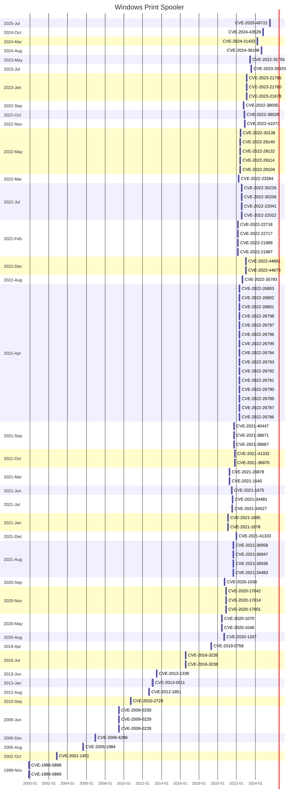

```mermaid
gantt
title Windows Print Spooler
dateFormat YYYY-MM-DD
axisFormat %Y-%m

section CVE Release Dates
section 2025-Jul
CVE-2025-49722 :cve0, 2025-07-08, 30d
section 2024-Oct
CVE-2024-43529 :cve1, 2024-10-08, 30d
section 2024-Mar
CVE-2024-21433 :cve3, 2024-03-12, 30d
section 2024-Aug
CVE-2024-38198 :cve2, 2024-08-13, 30d
section 2023-May
CVE-2022-35755 :cve5, 2023-05-31, 30d
section 2023-Jul
CVE-2023-35325 :cve4, 2023-07-11, 30d
section 2023-Jan
CVE-2023-21765 :cve6, 2023-01-10, 30d
CVE-2023-21760 :cve7, 2023-01-10, 30d
CVE-2023-21678 :cve8, 2023-01-10, 30d
section 2022-Sep
CVE-2022-38005 :cve13, 2022-09-13, 30d
section 2022-Oct
CVE-2022-38028 :cve12, 2022-10-11, 30d
section 2022-Nov
CVE-2022-41073 :cve11, 2022-11-09, 30d
section 2022-May
CVE-2022-30138 :cve19, 2022-05-18, 30d
CVE-2022-29140 :cve20, 2022-05-10, 30d
CVE-2022-29132 :cve21, 2022-05-10, 30d
CVE-2022-29114 :cve22, 2022-05-10, 30d
CVE-2022-29104 :cve23, 2022-05-10, 30d
section 2022-Mar
CVE-2022-23284 :cve39, 2022-03-09, 30d
section 2022-Jul
CVE-2022-30226 :cve15, 2022-07-12, 30d
CVE-2022-30206 :cve16, 2022-07-12, 30d
CVE-2022-22041 :cve17, 2022-07-12, 30d
CVE-2022-22022 :cve18, 2022-07-12, 30d
section 2022-Feb
CVE-2022-22718 :cve40, 2022-02-09, 30d
CVE-2022-22717 :cve41, 2022-02-09, 30d
CVE-2022-21999 :cve42, 2022-02-09, 30d
CVE-2022-21997 :cve43, 2022-02-09, 30d
section 2022-Dec
CVE-2022-44681 :cve9, 2022-12-13, 30d
CVE-2022-44678 :cve10, 2022-12-13, 30d
section 2022-Aug
CVE-2022-35793 :cve14, 2022-08-09, 30d
section 2022-Apr
CVE-2022-26803 :cve24, 2022-04-15, 30d
CVE-2022-26802 :cve25, 2022-04-15, 30d
CVE-2022-26801 :cve26, 2022-04-15, 30d
CVE-2022-26798 :cve27, 2022-04-15, 30d
CVE-2022-26797 :cve28, 2022-04-15, 30d
CVE-2022-26796 :cve29, 2022-04-15, 30d
CVE-2022-26795 :cve30, 2022-04-15, 30d
CVE-2022-26794 :cve31, 2022-04-15, 30d
CVE-2022-26793 :cve32, 2022-04-15, 30d
CVE-2022-26792 :cve33, 2022-04-15, 30d
CVE-2022-26791 :cve34, 2022-04-15, 30d
CVE-2022-26790 :cve35, 2022-04-15, 30d
CVE-2022-26789 :cve36, 2022-04-15, 30d
CVE-2022-26787 :cve37, 2022-04-15, 30d
CVE-2022-26786 :cve38, 2022-04-15, 30d
section 2021-Sep
CVE-2021-40447 :cve47, 2021-09-15, 30d
CVE-2021-38671 :cve48, 2021-09-15, 30d
CVE-2021-38667 :cve49, 2021-09-15, 30d
section 2021-Oct
CVE-2021-41332 :cve45, 2021-10-13, 30d
CVE-2021-36970 :cve46, 2021-10-13, 30d
section 2021-Mar
CVE-2021-26878 :cve57, 2021-03-11, 30d
CVE-2021-1640 :cve58, 2021-03-11, 30d
section 2021-Jun
CVE-2021-1675 :cve56, 2021-06-08, 30d
section 2021-Jul
CVE-2021-34481 :cve54, 2021-07-16, 30d
CVE-2021-34527 :cve55, 2021-07-02, 30d
section 2021-Jan
CVE-2021-1695 :cve59, 2021-01-12, 30d
CVE-2021-1678 :cve60, 2021-01-12, 30d
section 2021-Dec
CVE-2021-41333 :cve44, 2021-12-15, 30d
section 2021-Aug
CVE-2021-36958 :cve50, 2021-08-12, 30d
CVE-2021-36947 :cve51, 2021-08-12, 30d
CVE-2021-36936 :cve52, 2021-08-12, 30d
CVE-2021-34483 :cve53, 2021-08-12, 30d
section 2020-Sep
CVE-2020-1030 :cve64, 2020-09-11, 30d
section 2020-Nov
CVE-2020-17042 :cve61, 2020-11-11, 30d
CVE-2020-17014 :cve62, 2020-11-11, 30d
CVE-2020-17001 :cve63, 2020-11-11, 30d
section 2020-May
CVE-2020-1070 :cve66, 2020-05-21, 30d
CVE-2020-1048 :cve67, 2020-05-21, 30d
section 2020-Aug
CVE-2020-1337 :cve65, 2020-08-17, 30d
section 2019-Apr
CVE-2019-0759 :cve68, 2019-04-09, 30d
section 2016-Jul
CVE-2016-3239 :cve69, 2016-07-13, 30d
CVE-2016-3238 :cve70, 2016-07-13, 30d
section 2013-Jun
CVE-2013-1339 :cve71, 2013-06-12, 30d
section 2013-Jan
CVE-2013-0011 :cve72, 2013-01-09, 30d
section 2012-Aug
CVE-2012-1851 :cve73, 2012-08-15, 30d
section 2010-Sep
CVE-2010-2729 :cve74, 2010-09-15, 30d
section 2009-Jun
CVE-2009-0230 :cve75, 2009-06-10, 30d
CVE-2009-0229 :cve76, 2009-06-10, 30d
CVE-2009-0228 :cve77, 2009-06-10, 30d
section 2006-Dec
CVE-2006-6296 :cve78, 2006-12-05, 30d
section 2005-Aug
CVE-2005-1984 :cve79, 2005-08-10, 30d
section 2002-Oct
CVE-2001-1451 :cve80, 2002-10-22, 30d
section 1999-Nov
CVE-1999-0898 :cve81, 1999-11-04, 30d
CVE-1999-0899 :cve82, 1999-11-04, 30d
```
